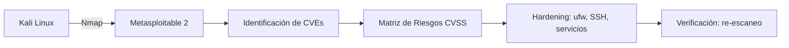

# Security Labs: Auditoría de Vulnerabilidades, Hardening y Políticas de Seguridad

Laboratorio de ciberseguridad en entorno aislado (Kali Linux vs Metasploitable 2 en red NAT): auditoría de vulnerabilidades con Nmap, correlación de CVEs, matriz de riesgos CVSS, hardening (ufw/SSH/eliminación de servicios EOL) y re-escaneo de verificación. Incluye guía paso a paso lista para producción con capturas documentadas para portafolio.

## Contenido

- **`SECURITY_LABS_GUIA.md`** — Guía completa en Markdown con las 7 secciones y apéndices:

| Sección | Descripción |
|---------|-------------|
| 1. Introducción y Arquitectura | Objetivos, diagrama de red aislada (Kali vs Target en NAT) |
| 2. Despliegue del Entorno | Configuración de red, verificación de IP y conectividad |
| 3. Reconocimiento y Análisis | Escaneos `nmap -sS/-sC/-sV`, CVEs (CVE-2011-2523, CVE-2007-2447) |
| 4. Auditoría y Matriz de Riesgos | Tabla de riesgos con scores CVSS y justificación de negocio |
| 5. Remediación y Hardening | `ufw` deny-by-default, deshabilitación de servicios, hardening de SSH, parcheo |
| 6. Re-Escaneo y Verificación | Comprobación posterior: de 21+ puertos abiertos a 1 |
| 7. Conclusiones | Resumen ejecutivo, lecciones y recomendaciones (NIST, ISO 27002, CIS) |

## Flujo del laboratorio

## Stack y herramientas

- **Atacante:** Kali Linux 2024.x
- **Objetivo:** Metasploitable 2 (VMware image)
- **Red:** NAT aislada (VirtualBox/VMware)
- **Herramientas:** Nmap (NSE), curl, ssh, ufw, apt

## Cómo usar

1. Despliega Kali Linux y Metasploitable 2 en red NAT aislada.
2. Abre `SECURITY_LABS_GUIA.md` y ejecuta cada fase en orden.
3. Toma las capturas indicadas por los marcadores `[CAPTURA_XX]` (inventario en el Apéndice A).

## Aviso

Proyecto exclusivamente educativo para uso en entorno local aislado. No utilizar contra sistemas sin autorización explícita por escrito.

## Autor

*(Completa con tu nombre y contacto / portafolio web)*