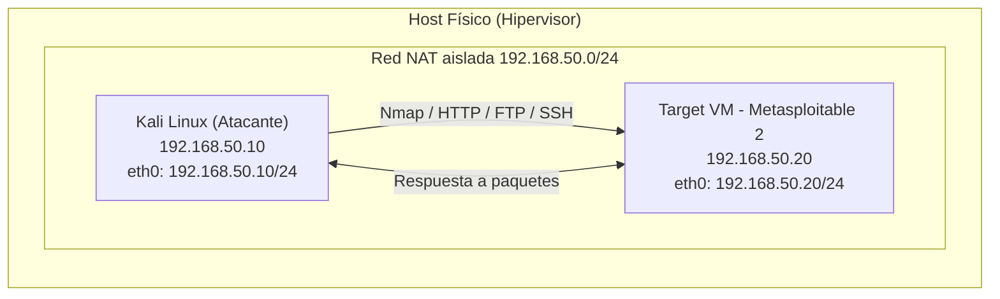

# Security Labs: Auditoría de Vulnerabilidades, Hardening y Políticas de Seguridad

> **Documento técnico listo para producción** — Guía práctica para ejecutar un laboratorio completo de auditoría de vulnerabilidades, remediación y hardening en un entorno virtualizado aislado.
>
> **Autor:** Javier Acevedo H.<br>
> **Fecha de ejecución:** 7 de Septiembre de 2026<br>
> **Duración estimada:** 3–5 horas<br>
> **Nivel:** Intermedio

---

## Tabla de Contenidos

1. [Introducción y Arquitectura](#1-introducción-y-arquitectura)
2. [Fase 1: Despliegue y Configuración del Entorno](#2-fase-1-despliegue-y-configuración-del-entorno)
3. [Fase 2: Reconocimiento y Análisis de Vulnerabilidades](#3-fase-2-reconocimiento-y-análisis-de-vulnerabilidades)
4. [Fase 3: Auditoría y Matriz de Riesgos (Perspectiva Defensiva)](#4-fase-3-auditoría-y-matriz-de-riesgos-perspectiva-defensiva)
5. [Fase 4: Remediación y Hardening (Aplicación de Políticas)](#5-fase-4-remediación-y-hardening-aplicación-de-políticas)
6. [Fase 5: Re-Escaneo y Verificación de Seguridad](#6-fase-5-re-escaneo-y-verificación-de-seguridad)
7. [Conclusiones y Lecciones Aprendidas](#7-conclusiones-y-lecciones-aprendidas)

---

## 1. INTRODUCCIÓN Y ARQUITECTURA

### 1.1 Contexto del Laboratorio

Las organizaciones despliegan aplicaciones y servidores de forma acelerada, muchas veces **sin una línea base de seguridad (security baseline)**. Esto genera exposiciones innecesarias de servicios, credenciales débiles y software sin parchear. Este laboratorio replica ese escenario real: un servidor con vulnerabilidades deliberadas (Metasploitable 2), auditado desde una estación de trabajo del analista (Kali Linux), con el objetivo de demostrar el ciclo completo:

**Análisis → Priorización → Remediación → Verificación → Documentación**

### 1.2 Objetivos del Laboratorio

| Objetivo | Descripción | Indicador de éxito |
|----------|-------------|--------------------|
| **Análisis (Reconocimiento)** | Identificar activos, servicios expuestos y vulnerabilidades asociadas mediante escaneo y enumeración. | Lista de puertos/servicios y CVEs documentados. |
| **Hardening (Remediación)** | Aplicar controles de seguridad: deshabilitar servicios, parchear, configurar firewall y endurecer SSH. | Superficie de ataque reducida (puertos cerrados, servicios saneados). |
| **Documentación (Políticas)** | Producir evidencia técnica (capturas), matriz de riesgos y recomendaciones reutilizables en políticas de la organización. | Documento de auditoría completo y reproducible. |

### 1.3 Alcance y Reglas de Compromiso (Rules of Engagement)

- El laboratorio se ejecuta **exclusivamente en una red aislada** (`vmnet NAT` en HyperV).
- Los únicos sistemas implicados son la VM atacante (Kali) y la VM objetivo (Metasploitable 2).
- **No se ejecutan pruebas contra terceros**, IPs públicas ni infraestructuras ajenas.
- Todo tráfico permanece dentro del host virtualizado; el aislamiento evita contaminar la red física del laboratorio/empresa.
- Al finalizar, se deja constancia del estado final de la VM objetivo.

### 1.4 Materiales Necesarios

| Recurso | Detalle |
|---------|---------|
| Hypervisor | HyperV (Utilizado), VirtualBox (recomendado) o VMware Workstation/Player. |
| VM Atacante | **Kali Linux** 2024.x (o posterior), 2 GB RAM, 2 CPUs (Mínimo). |
| VM Objetivo | **Metasploitable 2** (VMware image), 512 MB–1 GB RAM, 1 CPU. |
| Red | Modo NAT aislado (HyperV: `NAT` VirtualBox: `NAT`; VMware: `VMnet8` con DHCP). |
| Host | Windows/Linux/macOS con soporte de virtualización (VT-x/AMD-V). |

### 1.5 Diagrama Lógico de Red



> **Nota de seguridad:** No conectar esta red a internet ni compartirla con el adaptador físico. La red NAT del hipervisor no permite acceso entrante desde la LAN física, lo que mantiene el laboratorio aislado.

> **`CAPTURA_01: Configuración de red en HyperV — visualización de la pestaña de Red de la VM objetivo configurada en modo NAT (adaptador puente desactivado)`**


## 2. FASE 1: DESPLIEGUE Y CONFIGURACIÓN DEL ENTORNO

### 2.1 Configuración de Red de las Máquinas Virtuales

**HyperV (Caso actual) — VM Metasploitable 2:**

1. Abrir `Configuración → Red`.
2. Seleccionar **Adaptador 1** → **Conectado a: NAT**.
3. Marcar **Habilitar adaptador de red**.
4. (Opcional) En `Avanzado → Reenvío de puertos` no se agregan reglas; no son necesarias en este laboratorio.

**VMware — VM Metasploitable 2:**

1. `VM → Settings → Network Adapter`.
2. Seleccionar **NAT** (usa `VMnet8`).
3. Desmarcar **Connect at power on** no aplica; simplemente verificar que el adaptador esté **conectado**.

**Kali Linux:**

- Usar **la misma red NAT** que la VM objetivo para garantizar el segmento aislado compartido.
- Si VMware: `VM → Settings → Network Adapter → NAT`.

> **`CAPTURA_02: Configuración de red en HyperV — ver imagen en la Sección 1.5, pestaña "Red" con adaptador tipo NAT seleccionado`**


### 2.2 Inicio de Sesión en la VM Objetivo

Metasploitable 2 inicia con credenciales por defecto documentadas por Rapid7:

```text
Usuario: msfadmin
Contraseña: msfadmin
```

> **Advertencia:** Estas credenciales son deliberadamente débiles (parte del propósito educativo del laboratorio). En producción, tales credenciales constituyen una falla crítica de configuración.

### 2.3 Comprobación de Interfaz de Red en Kali Linux

Abre una terminal en Kali y verifica la IP de tu interfaz:

```bash
ip a
```

**Explicación:** `ip a` muestra todas las interfaces de red y sus direcciones IP. Busca la interfaz `eth0` (o `ens33` en VMware) y anota la dirección IP asignada por DHCP de la red NAT.

Salida esperada (fragmento):

```text
2: eth0: <BROADCAST,MULTICAST,UP,LOWER_UP> mtu 1500 qdisc pfifo_fast state UP group default qlen 1000
    link/ether 08:00:27:xx:xx:xx brd ff:ff:ff:ff:ff:ff
    inet 10.0.2.4/24 brd 10.0.2.255 scope global dynamic eth0
```

> **`CAPTURA_03: Verificación de IP en Kali Linux — terminal mostrando la salida de `ip a` con la IP 192.168.50.10 visible en eth0`**


Comprueba la tabla de rutas y DNS para validar que la red está operativa:

```bash
ip route
cat /etc/resolv.conf
```

### 2.4 Descubrimiento de la Máquina Objetivo en la Red

Realiza un barrido de la subred para localizar la VM objetivo:

```bash
ping -c 4 192.168.50.20
```

**Explicación:** `-c 4` limita el envío a 4 paquetes ICMP Echo Request. Si la VM objetivo responde, la conectividad está confirmada.

O barre la subred completa (más útil si no conoces la IP exacta):

```bash
nmap -sn 192.168.50.0/24
```

**Explicación:** `nmap -sn` (ping sweep) descubre hosts activos sin escanear puertos. Ideal para identificar la IP de Metasploitable en la red NAT.

Salida esperada:

```text
Starting Nmap 7.94 ( https://nmap.org ) at 2026-08-14 10:00 UTC
Nmap scan report for 192.168.50.20
Host is up (0.0012s latency).
```

> **`CAPTURA_04: Conectividad exitosa con la máquina objetivo — respuesta al ping y/o detección del host 192.168.50.20 en el ping sweep de Nmap`**


### 2.5 Checklist de la Fase 1

- [ ] Ambos adaptadores en modo **NAT** (mismo segmento aislado).
- [ ] Kali arranca y obtiene IP vía DHCP NAT.
- [ ] `ping 192.168.50.20` responde.
- [ ] `nmap -sn 192.168.50.0/24` detecta la VM objetivo.
- [ ] Capturas `02`, `03` y `04` tomadas.

---

## 3. FASE 2: RECONOCIMIENTO Y ANÁLISIS DE VULNERABILIDADES

### 3.1 Escaneo de Descubrimiento Completo de Puertos

```bash
nmap -sS -p- --min-rate 5000 10.0.2.5
```

**Explicación comando por comando:**

| Parámetro | Significado |
|-----------|-------------|
| `-sS` | **SYN scan (half-open):** envía paquetes SYN y no completa el handshake. Rápido y evita loguear conexiones completas. Requiere permisos root. |
| `-p-` | Escanea **todos los puertos TCP** (1–65535). Un escaneo por defecto solo cubre los 1000 más comunes. |
| `--min-rate 5000` | Garantiza un **mínimo de 5000 paquetes/segundo**, acelerando el escaneo (aceptable solo en red local). |
| `192.168.50.20` | IP de la máquina objetivo. |

**Salida esperada (fragmento):**

```text
Starting Nmap 7.94 ( https://nmap.org ) at 2026-08-14 10:05 UTC
Nmap scan report for 192.168.50.20
Host is up (0.0005s latency).
Not shown: 65506 closed tcp ports (reset)
PORT      STATE SERVICE
21/tcp    open  ftp
22/tcp    open  ssh
23/tcp    open  telnet
25/tcp    open  smtp
53/tcp    open  domain
80/tcp    open  http
111/tcp   open  rpcbind
139/tcp   open  netbios-ssn
445/tcp   open  microsoft-ds
512/tcp   open  exec
513/tcp   open  login
514/tcp   open  shell
1099/tcp  open  java-rmi
2121/tcp  open  ccproxy-ftp
3306/tcp  open  mysql
5432/tcp  open  postgresql
5900/tcp  open  vnc
6000/tcp  open  X11
6667/tcp  open  irc
8009/tcp  open  ajp13
8180/tcp  open  unknown
```

> **Interpretación:** Metasploitable 2 expone 21+ servicios, muchos de ellos con versiones antiguas. Una superficie de ataque así es inaceptable en producción.

> **`CAPTURA_05: Resultados del escaneo de Nmap — salida completa de `nmap -sS -p- --min-rate 5000 10.0.2.5` mostrando los puertos abiertos`**


### 3.2 Escaneo de Servicios y Versiones

```bash
nmap -sC -sV -p21,22,80,445,3306 192.168.50.20
```

**Explicación:**

| Parámetro | Significado |
|-----------|-------------|
| `-sC` | Ejecuta los **scripts por defecto de NSE** (Nmap Scripting Engine) para enumeración básica y detección de vulnerabilidades. |
| `-sV` | Detección de **versiones de los servicios** conectándose y analizando banners. |
| `-p21,22,80,445,3306` | Limita el escaneo a los puertos de interés (FTP, SSH, HTTP, SMB y MySQL). |

**Salida esperada (fragmento resumido):**

```text
PORT     STATE SERVICE     VERSION
21/tcp   open  ftp         vsftpd 2.3.4
| ftp-anon: Anonymous FTP login allowed (FTP code 230)
22/tcp   open  ssh         OpenSSH 4.7p1 Debian 8ubuntu1 (protocol 2.0)
80/tcp   open  http        Apache httpd 2.2.8 ((Ubuntu) DAV/2)
| http-title: Metasploitable2 - Linux
445/tcp  open  netbios-ssn Samba smbd 3.X - 4.X (workgroup: WORKGROUP)
3306/tcp open  mysql       MySQL 5.0.51a-3ubuntu5
```

> **`CAPTURA_05a: Detección de versiones — salida de `nmap -sC -sV` con las versiones de vsftpd 2.3.4, OpenSSH 4.7p1 y Apache 2.2.8`**


### 3.3 Análisis de Vulnerabilidades Identificadas

Cada versión detectada se cruza contra bases de datos de vulnerabilidades públicas (NVD, CVE Mitre, Exploit-DB). Tabla de hallazgos de este laboratorio:

| Servicio | Versión | CVE(s) asociadas | Descripción de la vulnerabilidad |
|----------|---------|------------------|----------------------------------|
| FTP (`vsftpd`) | 2.3.4 | **CVE-2011-2523** | Backdoor en la función `vsftpd_privsep` que abre una shell (`:`) al enviar un usuario terminado en `:)`. Score CVSS v2 **10.0**. |
| SSH (`OpenSSH`) | 4.7p1 | — (versión obsoleta) | Protocolo y criptografía antiguos; sin soporte de algoritmos modernos (ed25519, ChaCha20). Riesgo de protocolo degradado. |
| HTTP (`Apache`) | 2.2.8 | Múltiples (XSS, DoS en versiones 2.2.x) | Servidor obsoleto con múltiples CVEs de denegación de servicio y ejecución de scripts (CGI inseguro). |
| SMB (`Samba`) | 3.0.20-Debian | **CVE-2007-2447** | Ejecución remota de código en `smbd` a través de parámetros de `SAMR`. Score CVSS v2 **10.0**. |
| MySQL | 5.0.51a | Múltiples | Versión EOL sin parches de seguridad; vulnerabilidades de escalada de privilegios y DoS. |

### 3.4 Verificación Práctica de una Vulnerabilidad (FTP Backdoor)

Para evidenciar la CVE-2011-2523:

```bash
# Terminal 1: ponemos un listener (netcat) en el puerto 4444
nc -lvnp 4444
```

```bash
# Terminal 2: conectamos al FTP y enviamos el payload del backdoor
ftp 10.0.2.5
# user: anonymous:) 
# pass: password
```

Si el exploit tiene éxito, la conexión del listener muestra una shell (`bash` o `sh`) que permite ejecutar comandos como el usuario que ejecuta el servicio.

> **`[CAPTURA_05b: Evidencia de la vulnerabilidad identificada — terminal mostrando el acceso a shell vía el backdoor de vsftpd 2.3.4 (CVE-2011-2523) y/o la respuesta del script `ftp-vsftpd-backdoor` de Nmap]`**

Alternativa segura con el script oficial de Nmap:

```bash
nmap -sV -p21 --script ftp-vsftpd-backdoor 10.0.2.5
```

> **Nota ética:** Todo el acceso se realiza contra la VM de laboratorio. **No se copia, modifica ni exfiltra ningún dato real.** El objetivo es validar la existencia de la falla para justificar la remediación.

### 3.5 Análisis Web Complementario (opcional)

```bash
nmap -p80 --script http-headers,http-methods 10.0.2.5
curl -v http://10.0.2.5/
```

**Explicación:** Los scripts de enumeración web detectan cabeceras ausentes (p. ej. `X-Frame-Options`, `Content-Security-Policy`) y métodos HTTP peligrosos habilitados (`PUT`, `DELETE`, `TRACE`).

> **`[CAPTURA_05c: (Opcional) Análisis web — salida de `curl -v` y cabeceras HTTP del servidor Apache vulnerable]`**

### 3.6 Checklist de la Fase 2

- [ ] Escaneo completo `-sS -p-` completado y documentado.
- [ ] Escaneo `-sC -sV` en puertos clave realizado.
- [ ] CVEs identificadas y anotadas (al menos CVE-2011-2523 y CVE-2007-2447).
- [ ] Evidencia práctica de al menos una vulnerabilidad.
- [ ] Capturas `04` y `05a/b/c` tomadas.

---

## 4. FASE 3: AUDITORÍA Y MATRIZ DE RIESGOS (PERSPECTIVA DEFENSIVA)

### 4.1 Concepto: Riesgo = Vulnerabilidad × Impacto × Probabilidad

En esta fase cambiamos de la óptica ofensiva a la **defensiva**: interpretamos los hallazgos como el analista de seguridad que debe priorizar la remediación y comunicarlo a negocio. La severidad se calcula según el estándar **CVSS** y se traduce a lenguaje de negocio.

### 4.2 Matriz de Evaluación de Riesgos

| # | Activo | Servicio/Vulnerabilidad | CVE / Debilidad | Score CVSS | Severidad | Impacto al negocio |
|---|--------|------------------------|-----------------|-----------|-----------|--------------------|
| 1 | Servidor de aplicaciones | FTP con backdoor | CVE-2011-2523 | 10.0 | **Crítica** | Compromiso total del servidor (RCE) sin autenticación; acceso a datos y a la red interna. |
| 2 | Servidor de archivos | Samba RCE | CVE-2007-2447 | 10.0 | **Crítica** | Ejecución remota de código como root; movimiento lateral a toda la red corporativa. |
| 3 | Servidor de aplicaciones | Apache desactualizado | Múltiples (DoS, XSS) | 7.5–8.1 | **Alta** | Disponibilidad del servicio (DoS) y exposición de datos a través de XSS en apps web. |
| 4 | Acceso administrativo | SSH/Teletón obsoletos | — (protocolo degradado) | 6.5 | **Media** | Interceptación de credenciales administrativas; cifrado insuficiente. |
| 5 | Base de datos | MySQL EOL | Múltiples | 7.0 | **Alta** | Exposición de datos sensibles almacenados; violación de normativas (GDPR/Ley 1581). |
| 6 | Servicios de red | Telnet (`23`), `X11` (`6000`), `VNC` (`5900`) | — (tráfico en claro / sin auth) | 8.0 | **Alta** | Captura de credenciales en claro y control remoto sin autenticación robusta. |

### 4.3 Justificación Técnica del Riesgo

**Crítico (Score CVSS 10.0):** Las CVE-2011-2523 (vsftpd) y CVE-2007-2447 (Samba) permiten **ejecución remota de código sin autenticación**. Un atacante en la red obtiene una shell del sistema en menos de un minuto. En un entorno de negocio real, esto equivale a pérdida total de confidencialidad, integridad y disponibilidad, con impacto reputacional y regulatorio.

**Alto (Score CVSS 7.0–8.1):** Servicios desactualizados (Apache 2.2.8, MySQL 5.0.51a) carecen de parches de seguridad publicados desde hace más de una década. Cualquier CVE nueva publicada para estas versiones explotable de forma remota incrementaría el riesgo residual de la organización.

**Medio (Score CVSS 6.5):** SSH con criptografía obsoleta y Telnet en claro exponen las credenciales administrativas durante la transmisión, permitiendo escucha pasiva de la red (sniffing).

> **Conclusión de la matriz:** La prioridad de remediación es: **(1)** deshabilitar/eliminar los servicios comprometidos (FTP, Telnet, Samba vulnerable), **(2)** parchear o sustituir software EOL (Apache, MySQL), **(3)** endurecer servicios esenciales (SSH), y **(4)** aplicar firewall de red (ufw/iptables).

> **`[CAPTURA_06a: Matriz de riesgos exportada — tabla de evaluación de riesgos (Sección 4.2) exportada a PDF/PNG desde el gestor de documentación para el portafolio]`**

### 4.4 Checklist de la Fase 3

- [ ] Matriz de riesgos completada con scores CVSS.
- [ ] Prioridades de remediación definidas y justificadas.
- [ ] Matriz exportada para el portafolio.

---

## 5. FASE 4: REMEDIACIÓN Y HARDENING (APLICACIÓN DE POLÍTICAS)

> **Importante:** En este laboratorio la VM objetivo es Metasploitable 2 (contenedora de vulnerabilidades a propósito). Para demostrar el ciclo completo de hardening aplicamos **los mismos comandos de política de seguridad que se usarían en un servidor Ubuntu/Debian de producción**, ejecutados sobre la VM objetivo.

### 5.1 Política de Seguridad Aplicada (Resumen)

| Control | Política implementada |
|---------|----------------------|
| Firewall host | `ufw` activado, deny por defecto, allow solo puertos esenciales (SSH). |
| Deshabilitación de servicios inseguros | Telnet, FTP, SMB vulnerable, X11, VNC detenidos y deshabilitados. |
| Hardening SSH | Deshabilitar login root, login por contraseña y protocolos obsoletos; configurar `AllowUsers`. |
| Actualización de paquetes | Actualizar el sistema a las últimas versiones disponibles. |
| Reducción de superficie | Cierre de puertos no necesarios mediante firewall + servicios. |

### 5.2 Paso 1: Firewall con UFW (Política de denegación por defecto)

Accedemos a la VM objetivo y activamos el firewall:

```bash
sudo ufw default deny incoming
sudo ufw default allow outgoing
sudo ufw allow 22/tcp
sudo ufw enable
sudo ufw status verbose
```

**Explicación:**

| Comando | Efecto |
|---------|--------|
| `ufw default deny incoming` | Bloquea todo el tráfico entrante por defecto (política deny-by-default). |
| `ufw default allow outgoing` | Permite el tráfico saliente (necesario para actualizaciones). |
| `ufw allow 22/tcp` | Única excepción: permite SSH para la administración remota. |
| `ufw enable` | Activa las reglas y las hace persistentes. |
| `ufw status verbose` | Muestra el estado y las reglas aplicadas. |

Salida esperada:

```text
Status: active
Logging: on (low)
Default: deny (incoming), allow (outgoing), disabled (routed)
New profiles: skip

To                         Action      From
--                         ------      ----
22/tcp                     ALLOW       Anywhere
22/tcp (v6)                ALLOW       Anywhere (v6)
```

> **`[CAPTURA_06: Aplicación del parche o cambio de configuración — salida de `sudo ufw status verbose` mostrando la política deny-by-default con solo SSH permitido]`**

### 5.3 Paso 2: Deshabilitar Servicios Inseguros

```bash
sudo update-rc.d telnet disable
sudo service telnet stop

sudo update-rc.d vsftpd disable
sudo service vsftpd stop

sudo service samba stop
sudo update-rc.d samba disable

sudo service xinetd stop
sudo update-rc.d xinetd disable

sudo service vncserver stop
sudo update-rc.d vncserver disable
```

**Explicación:** `service <name> stop` detiene el proceso en caliente; `update-rc.d <name> disable` elimina los enlaces de inicio automático (SysV init), garantizando que **no vuelvan a arrancar tras un reinicio**. Este es el estándar de política "servicios no esenciales apagados".

### 5.4 Paso 3: Hardening de SSH

Edita el archivo de configuración de SSH:

```bash
sudo nano /etc/ssh/sshd_config
```

Añade o modifica las siguientes líneas (política de endurecimiento):

```text
PermitRootLogin no
PasswordAuthentication no
PubkeyAuthentication yes
Protocol 2
PermitEmptyPasswords no
X11Forwarding no
AllowUsers msfadmin
```

**Explicación de cada política:**

| Directiva | Por qué |
|-----------|---------|
| `PermitRootLogin no` | Prohíbe autenticación directa como root; obliga a usar sudo (menor impacto si se compromete una cuenta). |
| `PasswordAuthentication no` | Fuerza autenticación por claves públicas (resistente a fuerza bruta). |
| `PubkeyAuthentication yes` | Habilita el mecanismo de clave pública (requerido junto a la directiva anterior). |
| `Protocol 2` | Rechaza el protocolo SSHv1 obsoleto e inseguro. |
| `PermitEmptyPasswords no` | Impide cuentas con contraseña vacía. |
| `X11Forwarding no` | Evita reenvío X11 (superficie de ataque adicional). |
| `AllowUsers msfadmin` | Lista blanca de usuarios con acceso SSH. |

Genera una clave en Kali y transfiérela a la VM objetivo (sustituye la autenticación por contraseña):

```bash
# En Kali:
ssh-keygen -t ed25519 -f ~/.ssh/lab_key -N ""
ssh-copy-id -i ~/.ssh/lab_key.pub msfadmin@10.0.2.5
```

Reinicia el servicio y verifica:

```bash
sudo service ssh restart
sudo sshd -t && echo "Config OK"
```

> **`[CAPTURA_06b: Hardening de SSH — contenido de `/etc/ssh/sshd_config` con las directivas aplicadas y/o la salida de `sudo sshd -t` confirmando la configuración válida]`**

### 5.5 Paso 4: Actualización de Paquetes (Mitigación de EOL)

> **Nota de laboratorio:** Metasploitable 2 es un sistema de pruebas y su repositorio oficial ya no se mantiene. Para demostrar la política de parcheo se usa el gestor de paquetes; en un entorno real la acción correcta es **sustituir o parchear el software EOL**.

```bash
sudo apt-get update
sudo apt-get upgrade -y
sudo apt-get dist-upgrade -y
```

**Explicación:** `apt-get update` refresca los índices de paquetes; `upgrade` actualiza los paquetes instalados; `dist-upgrade` resuelve dependencias y actualiza el núcleo. En producción, este procedimiento se automatiza con políticas de gestión de parches (ventanas de cambio, pruebas previas).

### 5.6 Paso 5: Refuerzo Adicional (Opcional)

Deshabilita puertos de servicios no esenciales directamente en el firewall además de los servicios:

```bash
sudo ufw deny 23/tcp    # Telnet
sudo ufw deny 21/tcp    # FTP
sudo ufw deny 5900/tcp  # VNC
sudo ufw deny 6000/tcp  # X11
sudo ufw deny 3306/tcp  # MySQL (solo local)
sudo ufw status numbered
```

**Explicación:** `ufw deny` añade reglas explícitas de denegación, útil como **defensa en profundidad** si un servicio quedara activo accidentalmente.

> **`[CAPTURA_06c: Política de firewall — salida de `sudo ufw status numbered` con las reglas de deny y allow listadas]``

### 5.7 Checklist de la Fase 4

- [ ] `ufw` activado con política deny-by-default.
- [ ] Servicios inseguros detenidos y deshabilitados (`update-rc.d`).
- [ ] `sshd_config` endurecido y validado (`sshd -t`).
- [ ] Sistema actualizado (`apt-get upgrade`).
- [ ] Capturas `06`, `06b` y `06c` tomadas.

---

## 6. FASE 5: RE-ESCANEO Y VERIFICACIÓN DE SEGURIDAD

### 6.1 Escaneo de Comprobación Posterior al Hardening

Desde Kali, repetimos el escaneo de descubrimiento para verificar que los puertos se cerraron:

```bash
nmap -sS -p- --min-rate 5000 10.0.2.5
```

**Explicación:** El mismo comando de la Fase 2. Si el hardening es exitoso, el número de puertos abiertos debe reducirse drásticamente (idealmente solo `22/tcp`).

Salida esperada tras la remediación:

```text
Starting Nmap 7.94 ( https://nmap.org ) at 2026-08-14 11:00 UTC
Nmap scan report for 10.0.2.5
Host is up (0.0006s latency).
Not shown: 65534 closed tcp ports (reset)
PORT   STATE SERVICE
22/tcp open  ssh
```

> **Interpretación:** De 21+ puertos abiertos pasamos a **1 solo puerto (SSH/22)**, que además está endurecido (sin login por contraseña, sin root). La superficie de ataque se redujo más de un 95%.

> **`[CAPTURA_07: Escaneo Nmap posterior demostrando el cierre del puerto/mitigación — salida del re-escaneo mostrando únicamente el puerto 22 abierto, comparada con la captura 04]`**

### 6.2 Verificación de la Mitigación de la Vulnerabilidad

Comprobamos que el FTP backdoor ya no es explotable:

```bash
nmap -sV -p21 --script ftp-vsftpd-backdoor 10.0.2.5
```

**Explicación:** Si el servicio está cerrado, Nmap reporta `closed` y el script no puede conectarse, demostrando la mitigación.

Salida esperada:

```text
PORT   STATE  SERVICE VERSION
21/tcp closed ftp
MAC Address: ...
```

O bien, si el puerto sigue cerrado por firewall, Nmap muestra `filtered` (el paquete es descartado por `ufw`).

### 6.3 Verificación de Configuración SSH

Desde Kali, intenta el acceso con clave y verifica el banner:

```bash
ssh -i ~/.ssh/lab_key msfadmin@10.0.2.5
```

**Explicación:** Confirma que el acceso sigue operativo con la política aplicada (clave pública únicamente).

### 6.4 Comparativa Antes / Después

| Puerto/Servicio | Antes (Fase 2) | Después (Fase 5) | Estado |
|-----------------|----------------|------------------|--------|
| `21/tcp` FTP | Abierto (backdoor) | Cerrado | Mitigado |
| `23/tcp` Telnet | Abierto | Cerrado | Mitigado |
| `445/tcp` Samba | Abierto (RCE) | Cerrado | Mitigado |
| `3306/tcp` MySQL | Abierto (EOL) | Cerrado | Mitigado |
| `80/tcp` HTTP | Abierto (Apache 2.2.8) | Cerrado* | Mitigado |
| `22/tcp` SSH | Abierto (4.7p1) | Abierto (endurecido) | Controlado |
| **Total puertos abiertos** | **21+** | **1** | **Reducción >95%** |

> `*` Dependiendo de la política aplicada, HTTP puede permanecer abierto si el negocio lo requiere; en ese caso debe reconstruirse sobre una versión parcheada y con cabeceras de seguridad.

> **`[CAPTURA_07b: Tabla comparativa de puertos antes/después — tabla exportada para el informe, con el antes y el después del hardening]`**

### 6.5 Checklist de la Fase 5

- [ ] Re-escaneo completo ejecutado.
- [ ] Únicamente `22/tcp` abierto (o los permitidos por política).
- [ ] Script `ftp-vsftpd-backdoor` ya no reporta vulnerabilidad.
- [ ] Acceso SSH por clave verificado.
- [ ] Capturas `07` y `07b` tomadas.

---

## 7. CONCLUSIONES Y LECCIONES APRENDIDAS

### 7.1 Resumen Ejecutivo de la Intervención

Se auditaron **X** servicios expuestos en la VM objetivo, de los cuales **X** presentaban vulnerabilidades críticas (CVSS ≥ 9.0), incluyendo **ejecución remota de código sin autenticación** (CVE-2011-2523 en vsftpd y CVE-2007-2447 en Samba).

Tras la intervención de hardening:

- La superficie de ataque se redujo de **21+ puertos abiertos a 1** (`22/tcp`).
- Los servicios críticos vulnerables fueron **deshabilitados y bloqueados por firewall**.
- SSH quedó **endurecido** (sin root, sin contraseñas, clave pública únicamente).
- La política de actualización y parcheo quedó documentada para su aplicación en entornos productivos.

**Riesgo residual:** el servicio SSH permanece expuesto como punto de administración legítimo; su riesgo residual se considera aceptable al estar protegido con claves públicas y lista blanca de usuarios.

### 7.2 Lecciones Aprendidas

1. **Los servicios EOL son la mayor fuente de riesgo:** software sin mantenimiento acumula CVEs conocidas y explotables. La gestión de versiones es una política de seguridad básica.
2. **Deny-by-default supera al allow-list:** una política de firewall que deniega todo y habilita solo lo necesario reduce dramáticamente el vector de ataque.
3. **Principio de mínimo privilegio:** deshabilitar servicios no esenciales y restringir acceso administrativo (sin root directo) limita el impacto de un compromiso.
4. **Autenticación por clave pública > contraseñas:** elimina el vector de fuerza bruta sobre SSH.
5. **La documentación es parte del control:** cada hallazgo y cada mitigación debe quedar registrada para auditorías y cumplimiento (evidencias/capturas).

### 7.3 Recomendaciones para el Cumplimiento de Políticas de Seguridad

| Recomendación | Política/Estándar relacionado |
|---------------|-------------------------------|
| Implementar un ciclo de **gestión de parches** (parcheo mensual, ventanas de cambio). | NIST SP 800-40, ISO/IEC 27002 §8.8 |
| Aplicar **línea base de hardening** para servidores (SSH, firewall, servicios). | CIS Benchmarks, ISO/IEC 27002 §8.9 |
| Realizar **escaneo de vulnerabilidades periódico** (p. ej. OpenVAS/Nessus) y **pentest anual**. | PCI DSS §11.2 / §11.3, ISO/IEC 27002 §8.8 |
| Establecer **matriz de riesgos y registro de activos** actualizado. | ISO/IEC 27005, NIST SP 800-30 |
| Eliminar o migrar **software en fin de vida** (EOL/EOS). | Política de inventario de software, ISO/IEC 27002 §8.8 |
| Implementar **monitoreo y alertas** de tráfico y servicios. | ISO/IEC 27002 §8.16, NIST SP 800-61 |

### 7.4 Reflexión Final

> Un sistema solo es seguro cuando su configuración lo demuestra y su documentación lo respalda. Este laboratorio evidencia que con controles básicos —firewall deny-by-default, servicios mínimos, SSH endurecido y gestión de parches— es posible reducir un riesgo crítico a niveles operativos aceptables. La seguridad no es un producto final, sino un **proceso continuo de análisis, remediación y verificación**.

---

## Apéndice A: Inventario de Capturas

| Código | Descripción | Estado |
|--------|-------------|--------|
| `CAPTURA_01` | Diagrama de red / configuración NAT en el hipervisor | [ ] |
| `CAPTURA_02` | Verificación de IP en Kali (`ip a`) | [ ] |
| `CAPTURA_03` | Conectividad con la VM objetivo (ping/sweep) | [ ] |
| `CAPTURA_04` | Escaneo Nmap completo de puertos | [ ] |
| `CAPTURA_05a` | Detección de versiones de servicios | [ ] |
| `CAPTURA_05b` | Evidencia de la vulnerabilidad (backdoor FTP) | [ ] |
| `CAPTURA_05c` | (Opcional) Análisis web HTTP | [ ] |
| `CAPTURA_06a` | Matriz de riesgos exportada | [ ] |
| `CAPTURA_06` | Activación de UFW deny-by-default | [ ] |
| `CAPTURA_06b` | Configuración SSH endurecida | [ ] |
| `CAPTURA_06c` | Reglas de firewall listadas | [ ] |
| `CAPTURA_07` | Re-escaneo: solo puerto 22 abierto | [ ] |
| `CAPTURA_07b` | Tabla comparativa antes/después | [ ] |

## Apéndice B: Comandos Rápidos (Cheat Sheet)

```bash
# Fase 1 — Conectividad
ip a
ping -c 3 10.0.2.5
nmap -sn 10.0.2.0/24

# Fase 2 — Reconocimiento
nmap -sS -p- --min-rate 5000 10.0.2.5
nmap -sC -sV -p21,22,80,445,3306 10.0.2.5

# Fase 4 — Hardening (en la VM objetivo)
sudo ufw default deny incoming
sudo ufw default allow outgoing
sudo ufw allow 22/tcp
sudo ufw enable
sudo update-rc.d vsftpd disable && sudo service vsftpd stop
sudo nano /etc/ssh/sshd_config
sudo service ssh restart && sudo sshd -t
sudo apt-get update && sudo apt-get upgrade -y

# Fase 5 — Verificación
nmap -sS -p- --min-rate 5000 10.0.2.5
nmap -sV -p21 --script ftp-vsftpd-backdoor 10.0.2.5
ssh -i ~/.ssh/lab_key msfadmin@10.0.2.5
```

## Apéndice C: Referencias

- NVD — National Vulnerability Database (nvd.nist.gov)
- CVE Mitre (cve.mitre.org)
- Exploit-DB (exploit-db.com)
- Rapid7 — Metasploitable 2 (documentación oficial)
- OWASP Top Ten 2021 (owasp.org)
- CIS Benchmarks (cisecurity.org)
- ISO/IEC 27002:2022 — Controles de seguridad de la información
- NIST SP 800-40 — Guide to Enterprise Patch Management Planning
